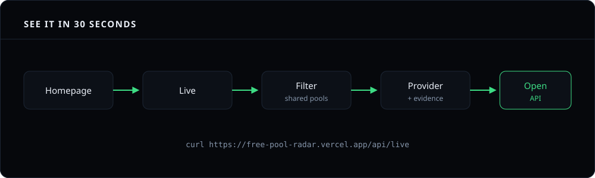
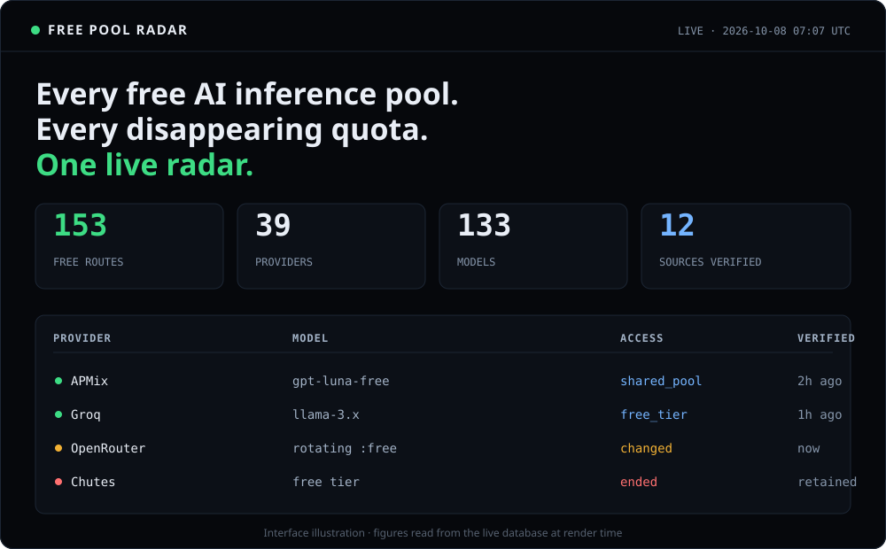
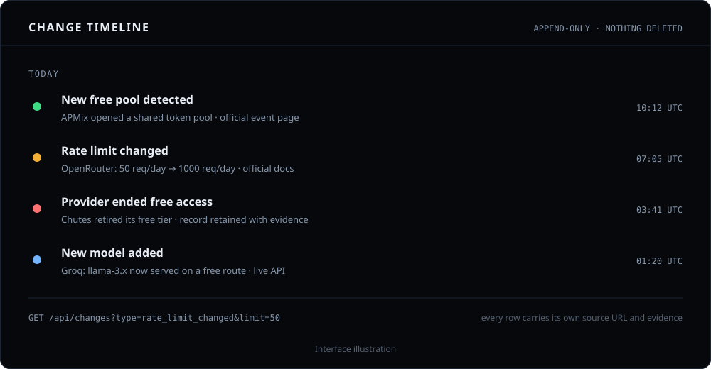
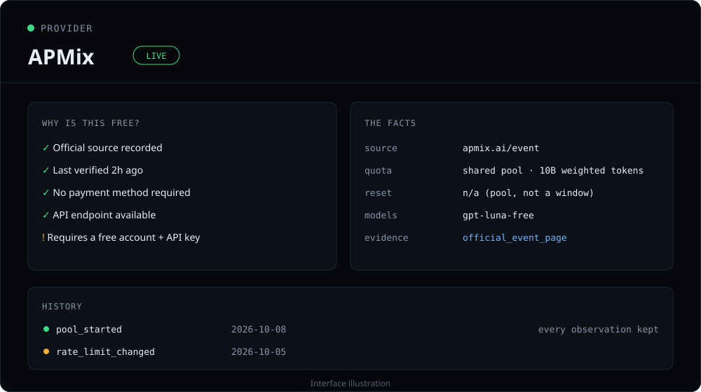

<div align="center">

# Free Pool Radar

**The open-source radar for genuinely free AI inference.**

Discover free AI APIs, shared inference pools, rotating models, promotional
events and free credits — with official evidence, verification timestamps and
historical change tracking.

> Don't trust a stale "free AI APIs" list. See what is actually free, why it
> qualifies, when it was last verified, and what changed.

[](https://github.com/vikramdex-ops/free-pool-radar/actions/workflows/ci.yml)
[](https://free-pool-radar.vercel.app)
[](API.md)
[](DATA-LICENSE)
[](LICENSE)

**[Open the live radar →](https://free-pool-radar.vercel.app)**

[Live](https://free-pool-radar.vercel.app/live) · [Providers](https://free-pool-radar.vercel.app/providers) · [Models](https://free-pool-radar.vercel.app/models) · [Timeline](https://free-pool-radar.vercel.app/timeline) · [Methodology](https://free-pool-radar.vercel.app/methodology) · [Public API](API.md) · [Self-hosting](SELF_HOSTING.md) · [MCP](MCP.md) · [Contributing](#contribute-a-provider)

</div>

---

## 🔴 Live right now

<!-- STATS:START -->

| 🟢 Free routes | 🏢 Providers | 🤖 Models | 🔎 Sources | 🕐 Cycle | ✅ Last verified |
|---:|---:|---:|---:|---:|---|
| **156** | **39** | **136** | **12** | every 5h | 2026-10-09 03:07 UTC |

<!-- STATS:END -->

*Figures are read from the live database, never hard-coded. This block is
rewritten automatically by [`.github/workflows/update-readme-stats.yml`](.github/workflows/update-readme-stats.yml),
which calls [`/api/stats`](API.md#endpoints).*

**[Open the live radar →](https://free-pool-radar.vercel.app/live)**

---

## Why Free Pool Radar exists

The AI ecosystem has thousands of pages claiming something is "free". The
problem is that **free** is not one thing. It can mean:

- permanently free · daily quota · shared pool
- promotional event · free credits · free trial
- card required · payment required · temporarily free
- **already exhausted**

A static list collapses all of those into one badge, goes stale within a week,
and never says *which* free — or whether it is still true.

**Free inference has state.** Free Pool Radar tracks that state and keeps the
record:

```text
   UPCOMING ─▶ LIVE ─▶ CHANGED ─▶ ENDING ─▶ EXHAUSTED ─▶ ENDED
```

Every offer carries its **source**, **verification time**, **access type**,
**quota**, **restrictions**, **current status** and **historical changes**.
Nothing is scored. Nothing is ranked. Nothing is invented.

Evidence-first. No opaque ranking.

---

## It's infrastructure, not a webpage

Free Pool Radar runs in three independent modes, so you can use whichever one
fits:

| Mode | What it is | Who it's for |
|---|---|---|
| **1 · Hosted** | Our live radar at [free-pool-radar.vercel.app](https://free-pool-radar.vercel.app) | People who want free inference now |
| **2 · Self-hosted** | Your own copy at `my-ai-radar.vercel.app` | Teams who want their own registry, sources and branding |
| **3 · Data engine** | A read-only API + open datasets you build on | Developers shipping bots, CLIs, dashboards and agents |

That gives the project three audiences — and all three are first-class:

| Audience | Why they care |
|---|---|
| **AI users** | Find free inference that is actually live right now |
| **Developers** | Consume the API, RSS feed and datasets |
| **Open-source developers** | Fork it and run their own radar |

---

## See it in 30 seconds

<p align="center">
  
</p>

The demo above is the path most people take: land on the homepage, filter the
live set, open a provider, read the evidence, then hit the API.

### The live radar

<p align="center">
  
</p>

### The change timeline

Free access changes constantly. The timeline is append-only — a withdrawn
offer stays on the record forever.

<p align="center">
  
</p>

### The provider page — *why is this free?*

<p align="center">
  
</p>

---

## 🍴 Deploy your own radar

Want your own Free Pool Radar? Fork this repository — the whole engine comes
with it. No vendor lock-in, no proprietary crawler, no paid API required.

1. **Fork** this repository.
2. **Create a Supabase project** and copy its URL + publishable key.
3. **Run the database migrations** (`supabase/migrations`).
4. **Add your environment variables** (see [`.env.example`](.env.example)).
5. **Deploy to Vercel** — import the repo and set the same variables.
6. **Add your provider sources** (collectors live in `supabase/functions/radar-sweep/core`).
7. **Your own radar is live** on your own domain.

The complete walkthrough, including the scheduler and the sweep function, is in
[**SELF_HOSTING.md**](SELF_HOSTING.md).

**[Fork this project →](https://github.com/vikramdex-ops/free-pool-radar/fork)**

> Your radar, your sources, your data. The MIT code licence and the CC0 data
> licence mean you can change anything and redistribute it.

---

## How it works

The frontend is a viewer, not the engine. Data is collected, verified and
written to Postgres on a schedule, and the site reads whatever is currently
true. A data change never needs a redeploy.

```text
pg_cron ──▶ Supabase Edge Function (Deno) ──▶ collectors
                              │                   │
                    normalise ─┴─ verify ─ change detection
                              ▼
                          Postgres
                              ▼
                     Next.js (ISR) ─▶ site · REST API · datasets · RSS
```

| Layer | Choice | Why |
|---|---|---|
| **Database** | Supabase Postgres | Six entities, append-only history, RLS for public reads |
| **Scheduler** | `pg_cron` + `pg_net` | Runs every 5 hours, independent of the frontend |
| **Collector** | Supabase Edge Function (Deno) | Fetches providers, reconciles, returns a report |
| **Frontend** | Next.js on Vercel | Reads the database; never needs a redeploy for data |
| **Writes** | Stored procedures only | One audited path into the intelligence store |

Full component-level detail is in [**ARCHITECTURE.md**](ARCHITECTURE.md).

---

## Data model

```text
providers     the registry: name, official URL, type, country, status
models        every model seen on a free route, with context and capabilities
offers        one free route: type, status, card/subscription/key terms, quotas
events        shared pools and promotions, with pool size and start time
observations  append-only: one row per sweep in which a collected value changed
changes       append-only: one row per detected difference between two sweeps
```

**Status** is exactly one of `upcoming`, `live`, `changed`, `ending`,
`exhausted`, `ended`, `suspended`, `unverified`.

**Access type** is tracked separately: `shared_pool`, `free_tier`,
`rotating_free_model`, `sponsored_inference`, `promotional_event`,
`free_credits`, `keyless`, `free_trial`, `ended`. An offer can be a shared pool
that is *also* rate limited and *also* card-gated. Collapsing those into one
"free" badge is the mistake this product exists to avoid.

**Verification level** is a named rank, not a numeric trust score:
`live_api`, `official_docs`, `official_event_page`, `official_announcement`,
`official_social`, `secondary`, `community`.

The rules that govern every field are in [**METHODOLOGY.md**](METHODOLOGY.md),
and the user-facing statement is at
[`/methodology`](https://free-pool-radar.vercel.app/methodology).

---

## Public API

Read-only, no key required, same data the site renders. Full reference:
[**API.md**](API.md).

```text
GET /api/live         currently usable free routes
GET /api/offers       the same set under its fuller name
GET /api/upcoming     announced pools and events
GET /api/ended        withdrawn access, retained permanently
GET /api/providers    the provider registry
GET /api/models       every model on a free route
GET /api/events       pools and promotional events
GET /api/changes      the change log (?type=card_required&limit=50)
GET /api/stats        headline counts + verification cycle
```

```bash
curl https://free-pool-radar.vercel.app/api/stats | jq
```

```json
{
  "data": {
    "freeRoutes": 153,
    "providers": 39,
    "models": 133,
    "sources": { "total": 12, "ok": 11, "impaired": 1 },
    "verificationCycleHours": 5
  },
  "generatedAt": "2026-10-08T07:09:00.000Z"
}
```

Timestamps are ISO 8601. The editorial `28 SEP 2026 · 17:00 UTC` form on the
site is a presentation choice, not the wire format.

---

## Build on the data

Every dataset is open (CC0 1.0) and downloadable. See
[**DATASET.md**](DATASET.md) for the schema and column definitions.

```text
GET /api/dataset        everything, one document
GET /data/latest.json   the combined latest snapshot
GET /data/latest.csv    the same snapshot as CSV
GET /feed.xml           Atom feed — new pools, changes and withdrawals
```

People build things on this:

- 🤖 **Discord / Telegram bots** that announce a new free pool the moment it appears
- 🧩 **MCP servers** so coding agents can find free inference mid-session
- 📱 **Browser extensions** that surface a live free route while you read a provider's docs
- 💻 **CLIs** that answer "give me a free endpoint for a reasoning model"
- 🌐 **Dashboards, newsletters and research** over the change history

```bash
curl https://free-pool-radar.vercel.app/api/dataset -o radar.json
```

---

## Subscribe: the Atom feed

```text
Free Pool Radar ──▶ new pool detected ──▶ feed.xml ──▶ your reader
                                      └──▶ your relay ──▶ Discord / Slack / Telegram
```

Point a feed reader at
`https://free-pool-radar.vercel.app/feed.xml` to be told whenever a new free
inference pool appears, a quota changes, or a provider withdraws access.

There is no hosted webhook service — the feed is the subscription surface. A
relay of your own (a few lines on a cron, or an RSS-to-webhook bridge) turns it
into Discord, Slack or Telegram messages. See
[ECOSYSTEM.md](ECOSYSTEM.md) for the worked examples we would like to list.

---

## Ecosystem

Free Pool Radar is meant to be built on. The
[**ecosystem page**](https://free-pool-radar.vercel.app/ecosystem) lists
first-party surfaces and community projects; add yours via a PR.

| Project | Type | Status |
|---|---|---|
| Free Pool Radar API | REST | ✅ shipped |
| Free Pool Radar datasets | JSON / CSV | ✅ shipped |
| Free Pool Radar feed | RSS / Atom | ✅ shipped |
| Free Pool Radar MCP | MCP server | ✅ shipped — see [MCP.md](MCP.md) |
| FreePool CLI | CLI | 🟡 seeking contributor |
| Free Pool Discord bot | Bot | 🟡 seeking contributor |
| Free AI Finder | Browser extension | 🟡 seeking contributor |

---

## ⭐ Why star Free Pool Radar?

Star the project if you want to:

- keep a bookmark to the live radar
- follow changes to free AI access over time
- support an open-source alternative to static API lists
- help the project become a community-maintained dataset
- discover new free inference pools as they appear

<p align="center">

**[⭐ Star the repo](https://github.com/vikramdex-ops/free-pool-radar/stargazers)**
· **[🍴 Fork your own radar](https://github.com/vikramdex-ops/free-pool-radar/fork)**
· **[🐛 Report a changed provider](https://github.com/vikramdex-ops/free-pool-radar/issues/new?template=changed-offer.yml)**
· **[➕ Add a source](https://github.com/vikramdex-ops/free-pool-radar/issues/new?template=new-provider.yml)**
· **[📡 Build something with the API](API.md)**

</p>

---

## Contribute a provider

The fastest way to contribute is to add or correct a provider. Use the
structured issue template — it asks for everything the collector needs:

**[➕ New provider](https://github.com/vikramdex-ops/free-pool-radar/issues/new?template=new-provider.yml)** ·
**[🔄 Changed offer](https://github.com/vikramdex-ops/free-pool-radar/issues/new?template=changed-offer.yml)** ·
**[✨ Feature request](https://github.com/vikramdex-ops/free-pool-radar/issues/new?template=feature.yml)** ·
**[🐛 Bug](https://github.com/vikramdex-ops/free-pool-radar/issues/new?template=bug_report.yml)**

### Good first issues

These are scoped to be finishable in an evening:

| Label | Task |
|---|---|
| 🟢 `good first issue` | Add official verification for a provider |
| 🟢 `good first issue` | Add a newly available model from an existing provider |
| 🟢 `good first issue` | Add an API example for a language we don't cover yet |
| 🟢 `good first issue` | Add country availability to a provider |
| 🟡 `help wanted` | Build the CLI (`FreePool CLI`) |
| 🟡 `help wanted` | Add an RSS → Discord webhook example |
| 🔴 `help wanted` | Extend the MCP server |

See [**CONTRIBUTING.md**](CONTRIBUTING.md) before opening a PR.

---

## Running it locally

```bash
git clone https://github.com/vikramdex-ops/free-pool-radar.git
cd free-pool-radar
npm install
cp .env.example .env.local     # then fill it in
npm run dev
```

You need a Supabase project and its publishable key. Nothing else.

```env
NEXT_PUBLIC_SUPABASE_URL=https://YOUR_PROJECT_REF.supabase.co
NEXT_PUBLIC_SUPABASE_PUBLISHABLE_KEY=sb_publishable_...
```

The frontend renders an explicit *database not configured* state rather than
sample data if these are missing — it will never invent a figure.

### Database and monitoring

```bash
npx supabase link --project-ref YOUR_PROJECT_REF
npx supabase db push                                      # schema, RLS, scheduler, RPCs
npx supabase db query --linked --file supabase/seed.sql   # researched baseline
npx supabase functions deploy radar-sweep --no-verify-jwt
```

Put the project's secret key in Supabase Vault under `supabase_secret_key` so
`pg_net` can authenticate the scheduled call — see `supabase/vault.sql`. Then
the hourly tick picks it up and the first sweep runs within the hour.

To rebuild a dataset from scratch, `supabase/reset-data.sql` clears the
collected data and leaves the schema, policies, procedures and schedule intact.

### Checks

```bash
npx tsc --noEmit                 # types
node scripts/check-seed.mjs supabase/seed.sql
node scripts/verify.mjs          # pages, both themes, both viewports
node mcp/smoke.mjs               # MCP server protocol handshake
```

`verify.mjs` asserts every page returns 200 with no console errors, that
nothing scrolls sideways at 390px or 1440px, and that no content escapes its
container. It expects a server on `$BASE` (default `http://localhost:3100`).

---

## What this project will not do

- Rank providers, or publish a quality score
- Call a time-boxed trial "free" without saying when it ends
- Present a promotional credit as equivalent to pooled tokens
- Republish a third-party list without verifying each entry
- Resolve a conflict by quietly picking a side
- Fill an empty state with invented data
- Delete a record because an offer ended

## Independent

Free Pool Radar is an independent information service. It is not affiliated
with, endorsed by, or sponsored by any provider listed. It takes no payment
from providers and uses no affiliate links.

Free access can be withdrawn, rate-limited, modified or exhausted without
notice. Always review the provider's current terms, privacy policy and usage
restrictions before sending sensitive or production data. All timestamps are
UTC.

MIT licence (code). Collected data: CC0 1.0 Universal. Provider and model names
are trademarks of their respective owners; inclusion is not an endorsement.
Full terms and attribution requirements in the [LICENSE](LICENSE) and
[DATA-LICENSE](DATA-LICENSE) files.

---

## Repository map

```text
README.md          this file
METHODOLOGY.md     the rules every figure must satisfy
ARCHITECTURE.md    how the pipeline, schema and frontend fit together
API.md             the public REST API reference
DATASET.md         the downloadable datasets and their columns
SELF_HOSTING.md    run your own radar
MCP.md             use the radar from a coding agent
ECOSYSTEM.md       projects built on Free Pool Radar
CONTRIBUTING.md    how to contribute
CODE_OF_CONDUCT.md community expectations
SECURITY.md        how to report a vulnerability
CHANGELOG.md       version history
```
